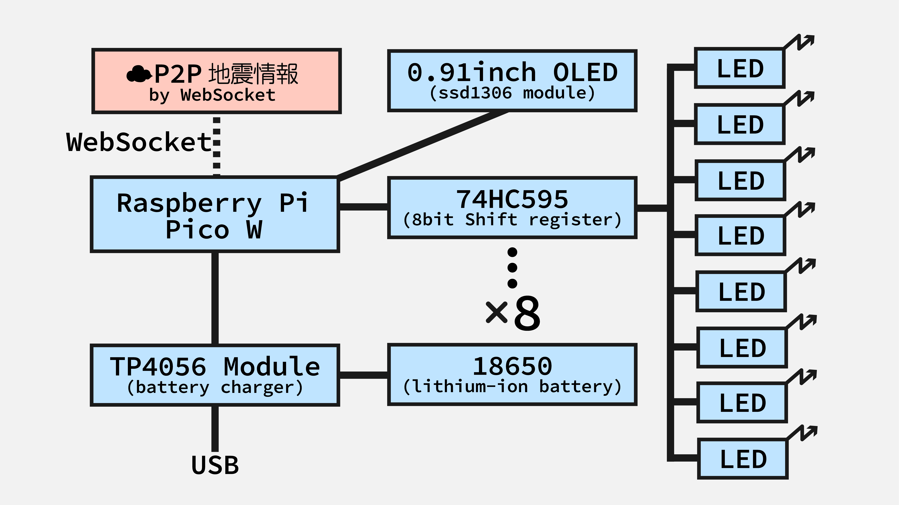
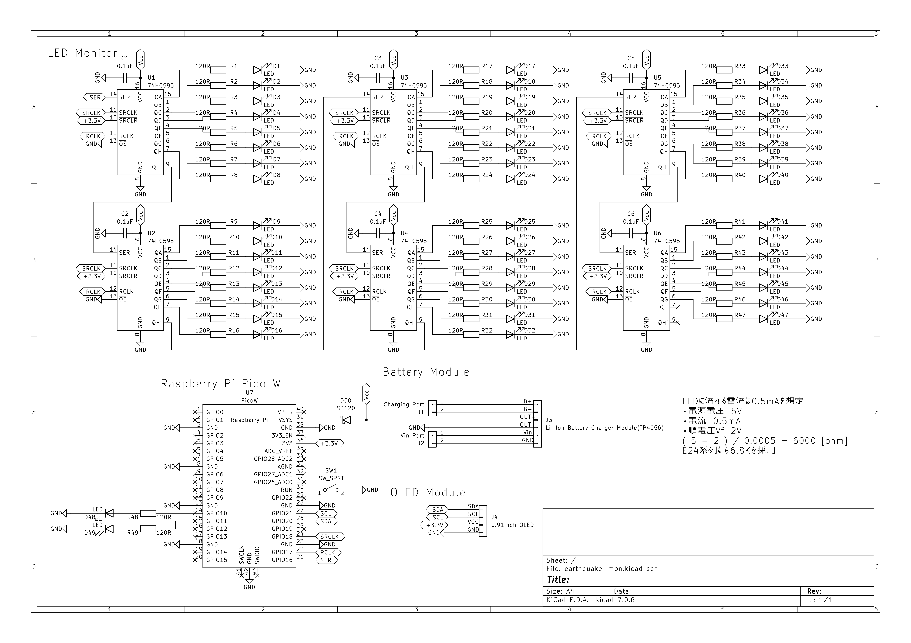
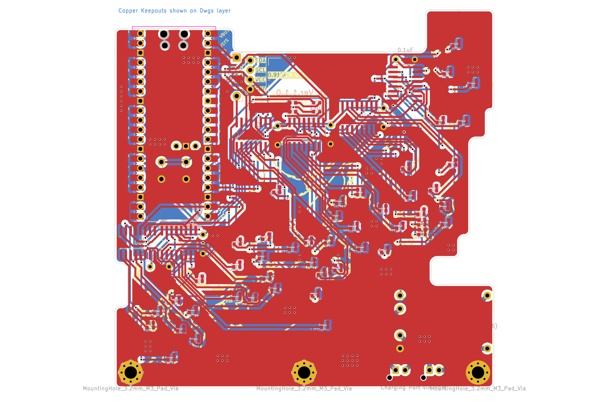

# pico-earthquake-mon

Raspberry Pi Pico Wを使って「地震情報をリアルタイム」で表示するインフォメーションモニタです。

地震情報は「P2P地震情報」が提供しているWebSocketで取得しています。

[P2P地震情報 - Wikipedia](https://ja.wikipedia.org/wiki/P2P%E5%9C%B0%E9%9C%87%E6%83%85%E5%A0%B1)

地震情報は、震源地・地震の深さ・発生日時・震度・規模の5つがOLED（128×32）に表示されます。

揺れを取得した都道府県は基板上の各LEDに対応しており、揺れた都道府県に対応したLEDが点灯します。

リチウムイオン電池（18650）を使うので、スタンドアロンで使用できます。

----

## 開発環境

・MicroPython(v1.22.2)

・Thonny(v4.0.2)

----

## 動作の様子


実際の動作の様子です。

受信する地震情報についてはリアルタイムのものではなくダミー用に表示しているものです。

土台は3Dプリンタ（光造形）で作製しています。

STLファイルは[case.stl](hogehoge)にあります。

----

## 部品リスト

|部品名|個数|購入先リンク|注意|
|:--|:--|:--|:--|
|メイン基板|1||BOOTHに出品予定？|
|Raspberry Pi Pico W|1|https://akizukidenshi.com/catalog/g/g117947/||
|タクトスイッチ|1|https://akizukidenshi.com/catalog/g/g103646/|Pi Picoリセット用。色はなんでもよい|
|TP4056 リチウム電池充電モジュール|1|https://amzn.asia/d/iQMhM1q|Amazon等に出回っている汎用充電モジュール|
|XHコネクタ メス|2|https://akizukidenshi.com/catalog/g/g112247/||
|XHコネクタ オス|1-2|https://akizukidenshi.com/catalog/g/g112255/||
|XHコネクタ コンタクト|2|https://akizukidenshi.com/catalog/g/g112264/||
|リチウム電池（18650）|1|リンク省略|生セルでも可|
|リチウム電池（18650）電池ボックス|1|https://akizukidenshi.com/catalog/g/g108407/||
|電線|適宜|https://akizukidenshi.com/catalog/g/g110672/||
|ショットキーバリアダイオードSB240LES|1|https://akizukidenshi.com/catalog/g/g107787/||
|コンデンサ 0.15uF 50V|6|https://akizukidenshi.com/catalog/g/g108145/|バイパスコンデンサ。タンタルコンデンサが好ましい|
|TC74HC595AF|6|https://akizukidenshi.com/catalog/g/g110077/|8bitシフトレジスタ|
|緑色チップLED 1608|49|https://akizukidenshi.com/catalog/g/g111878/||
|チップ抵抗 1/10W 3kΩ|49|https://akizukidenshi.com/catalog/g/g106302/|眩しいため6kΩ程度が望ましい|
|細ピンヘッダ|20*2 4 6|https://akizukidenshi.com/catalog/g/g104398/|Pi Pico固定用とOLED固定用とTP4056モジュール固定用|
|M3×35ボルト|2|リンク省略|基板立て用。長さは35mmでなくてもよい|
|M3ナット|2|リンク省略|基板立て用|
|はんだ|適宜|リンク省略|はんだ用|

----

## ブロック図



★Raspberry Pi Pico WをP2P地震情報とWebSocketを使い通信します。

★WebSocketにConnectし、地震情報の受信を待機します。

★受信した情報をパースし、OLEDに地震情報を表示します。

★受信した情報をパースし、揺れた都道府県を取得し、基板上で対応するLEDを点灯させます。

★47都道府県なので、LEDは47個あります。LEDの制御はシフトレジスタ（74HC595）を用います。

★上記47個に加えて、緊急地震速報を示すLEDと機器の接続状況を示すLEDの2個が設定されています。

★スタンドアロンで使用するため、TP4056モジュールを介してRaspberry Pi Pico WのVsysピンへ電源を供給します。

----

## 回路図



★シフトレジスタはカスケード接続させています。

★Raspberry Pi Pico WのVsysに電源供給し動作させる場合、ショットキーバリアダイオードが必須です。

★ショットキーバリアダイオードは一般的なダイオード特性に加え、順方向電圧（Vf）が低い点が特徴です。

----

## ガーバーデータ（基板発注のためのデータ）

ガーバーデータは[ここ](https://github.com/underMHz/pico-earthquake-mon/blob/main/gerber_pico-earthquake-mon.zip)からDLできます。

[JLCPCB](https://jlcpcb.com/)での発注を想定しています。



----

## 接続

|PicoW|OLED|74HC595|TP4056 Module|Other|
|:--|:--|:--|:--|:--|
|`VSYS`||`VCC`|`OUT+`||
|`3V3`|`VCC`|`SRCLR`|||
|`GND`|`GND`|`GND` `OE`|`OUT-`||
|`RUN`||||`GND`|
|`GPIO16`||`SER`|||
|`GPIO17`||`RCLK`|||
|`GPIO18`||`SRCLK`|||
|`GPIO20`|`SDA`||||
|`GPIO21`|`SCL`||||
||||`B+`|`Li-Battery+`|
||||`B-`|`Li-Battery-`|
||||`Vin`|`USB+`|
||||`GND`|`USB-`|

・GPIO10に緊急地震速報表示用のLEDを接続

・GPIO11にStatus表示用のLEDを接続

----

## コードについて

MicroPythonで開発を行っています。

コードは[ここ](hogehoge)からDLできます。

main.pyは以下の通り。

```Python
'''
（工事中🔨）
'''
print('Hello World!')
```

----

## ファイル構成

- ThonnyからPython Package Index(PyPI)からインストールするライブラリ

`ssd1306`

- 外部から追加するライブラリ

`uwebsocketsclient`
https://github.com/underMHz/uwebsockets-client/blob/main/uwebsocketsclient.py

`P2P地震情報（https://www.p2pquake.net/）の証明書`
（工事中🔨）

- 使用するフォント

`misakifont`（美咲フォント）
https://github.com/Tamakichi/pico_MicroPython_misakifont/tree/main/misakifont

❓美咲フォントについて
https://littlelimit.net/misaki.htm

RASPBERRY PI PICO<br>
│&nbsp;&nbsp;main.py<br>
│&nbsp;&nbsp;test.py<br>
│<br>
├─lib<br>
│&nbsp;&nbsp;&nbsp;&nbsp;│<br>
│&nbsp;&nbsp;&nbsp;&nbsp;└─ssd1306<br>
│<br>
└─misakifont<br>
&nbsp;&nbsp;&nbsp;&nbsp;&nbsp;&nbsp;&nbsp;&nbsp;（略）<br>
        
----
